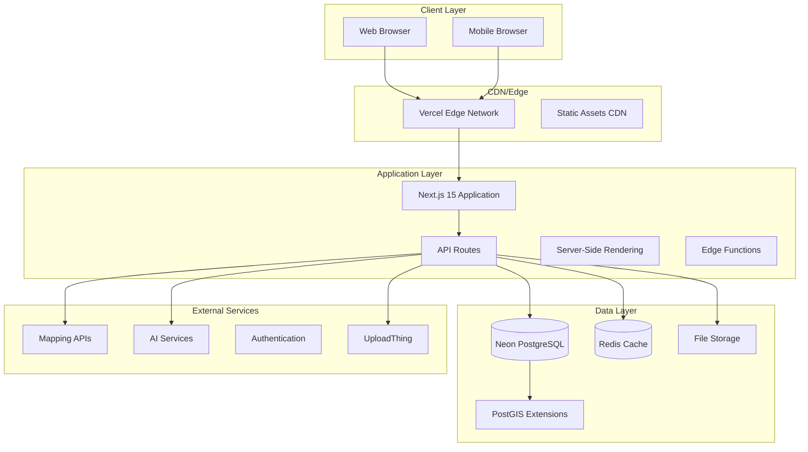
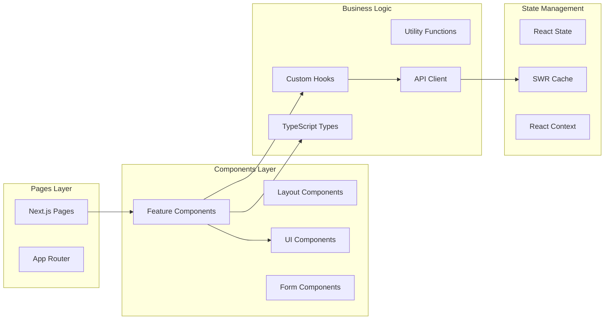
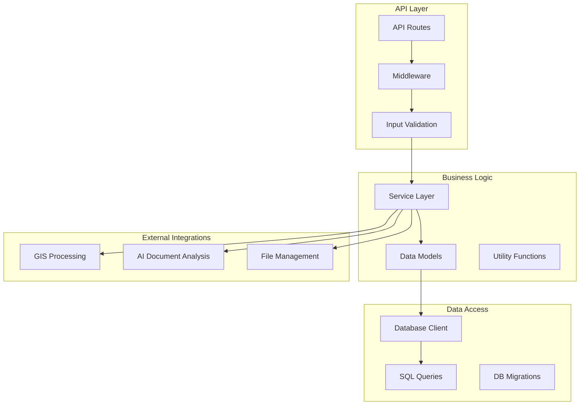
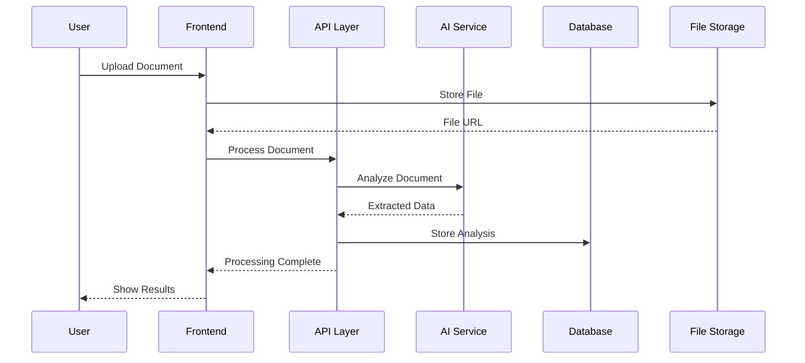
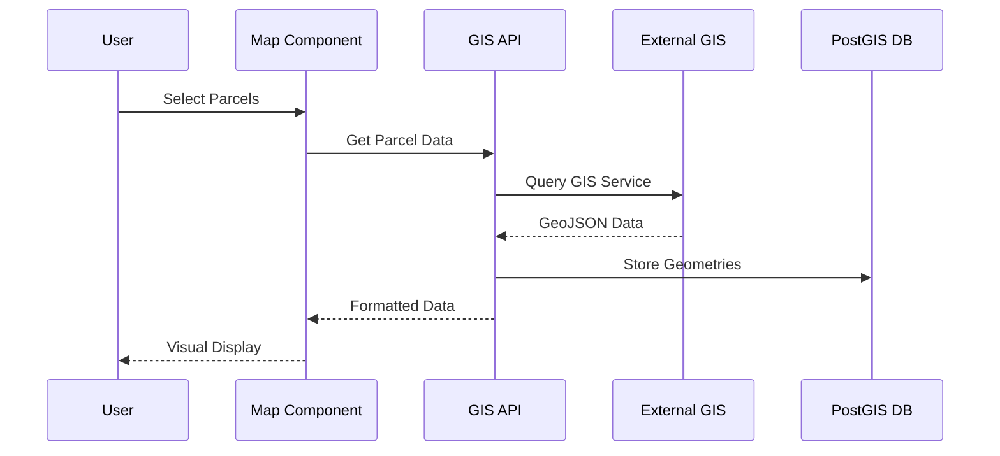

# System Architecture Documentation
## Landscape Real Estate Development Platform

**Last Updated:** 2025-11-02
**Version:** 3.5 (includes Migration 013 - Project Type Code Standardization)

## Recent Updates

### Migration 013 - Project Type Code Standardization (Nov 2, 2025)
- **Standardized Project Type Codes**: 7 official codes (LAND, MF, OFF, RET, IND, HTL, MXU)
- **Database Schema Change**: Renamed `property_type_code` → `project_type_code` in `landscape.tbl_project`
- **Frontend Updates**: 21 files updated to use `project_type_code`
- **Django Backend**: Models and serializers updated for new field name
- **Tab Routing**: Updated to recognize standardized LAND code
- **Dashboard**: Added support for all 7 standardized codes

### High-Level Architecture



### Component Architecture

#### Frontend Architecture


#### Backend Architecture


### Data Flow Architecture

#### Document Processing Flow


#### GIS Data Flow


### Technology Stack Details

#### Frontend Technologies
```yaml
Core Framework:
  - Next.js: 15.5.0 (App Router, Server Components)
  - React: 19.1.0 (Latest features, concurrent rendering)
  - TypeScript: 5.x (Full type safety)

UI Libraries:
  - Material-UI: 7.x (Enterprise components)
  - Radix UI: Accessible primitives
  - TailwindCSS: Utility-first styling
  - Lucide React: Icon system

Specialized:
  - MapLibre GL: High-performance mapping
  - Handsontable: Spreadsheet functionality
  - React Data Grid: Advanced data tables
  - SWR: Data fetching and caching
```

#### Backend Technologies
```yaml
Database:
  - Neon PostgreSQL: Serverless, auto-scaling
  - PostGIS: Spatial data extensions
  - Connection pooling: Built-in Neon features

Processing:
  - PDF Parse: Document text extraction
  - Turf.js: Geospatial calculations
  - Shapefile: GIS file processing
  - XLSX: Excel file handling

Infrastructure:
  - Vercel: Hosting and edge deployment
  - UploadThing: File storage and management
  - Environment-based configuration
```

### API Architecture

#### RESTful Endpoint Design
```yaml
Core Resources:
  /api/projects/*: Project management
  /api/parcels/*: Land parcel operations
  /api/landuse/*: Development planning
  /api/gis/*: Geospatial operations
  /api/ai/*: AI-powered features
  /api/fin/*: Financial planning
  /api/budget/*: Budget management
  /api/admin/*: Administrative functions

Authentication:
  Pattern: Header-based (when implemented)
  Authorization: Role-based access control
  Session: Stateless JWT tokens

Error Handling:
  Format: Consistent JSON error responses
  Status Codes: Standard HTTP codes
  Logging: Structured error logging
```

#### Database Schema Overview
```sql
-- Core Business Entities
tbl_project (
  project_id,
  project_name,
  project_type_code,  -- Migration 013: Standardized codes (LAND, MF, OFF, RET, IND, HTL, MXU)
  location,
  ...
)
tbl_parcel (parcel_id, project_id, geometry, ...)
tbl_landuse (landuse_id, type, specifications, ...)
tbl_phase (phase_id, project_id, timing, ...)

-- Financial Planning
fin_budget (budget_id, project_id, categories, ...)
fin_line_item (line_id, budget_id, amount, ...)
market_assumptions (assumption_id, market_data, ...)

-- GIS and Spatial
project_boundaries (boundary_id, geometry, ...)
gis_tax_parcel_ref (parcel_ref, geometry, ...)

-- AI and Documents
ai_ingestion_history (ingestion_id, documents, ...)
ai_review_history (review_id, analysis, ...)
```

### Security Architecture

#### Current Security Measures
```yaml
Data Protection:
  - SQL Injection: Parameterized queries
  - XSS Prevention: React's built-in protection
  - CSRF: SameSite cookie attributes
  - Input Validation: Zod schema validation

Infrastructure:
  - HTTPS: TLS 1.3 encryption
  - Environment Variables: Secret management
  - Database: Connection string encryption
  - Files: Secure upload handling

Development:
  - TypeScript: Compile-time safety
  - ESLint: Security rule enforcement
  - Dependencies: Regular updates
  - Git Hooks: Pre-commit validation
```

#### Security Gaps to Address
```yaml
Missing Components:
  - Authentication system
  - Authorization middleware
  - Rate limiting
  - Security headers (CSP, HSTS)
  - Input sanitization
  - Audit logging
  - Session management
  - API key management
```

### Performance Architecture

#### Optimization Strategies
```yaml
Frontend Performance:
  - Code Splitting: Next.js automatic splitting
  - Image Optimization: Next.js Image component
  - Bundle Analysis: Webpack bundle analyzer
  - Caching: SWR for client-side caching
  - Lazy Loading: Component-level lazy loading

Backend Performance:
  - Database Indexing: Strategic index placement
  - Query Optimization: Direct SQL queries
  - Connection Pooling: Neon built-in pooling
  - Edge Computing: Vercel edge functions
  - CDN: Static asset distribution

Monitoring:
  - Client-side: Web Vitals tracking
  - Server-side: Response time monitoring
  - Database: Query performance analysis
  - Error Tracking: Structured error logging
```

### Deployment Architecture

#### Infrastructure as Code
```yaml
Hosting Platform: Vercel
  - Automatic deployments from Git
  - Preview deployments for PRs
  - Edge function deployment
  - Environment management

Database: Neon PostgreSQL
  - Serverless auto-scaling
  - Point-in-time recovery
  - Read replicas available
  - Connection pooling

File Storage: UploadThing
  - CDN-backed file serving
  - Automatic image optimization
  - Secure upload handling
  - File type validation

CI/CD Pipeline:
  - Git hooks: Pre-commit linting
  - Automated builds: Turbopack
  - Type checking: TypeScript
  - Deploy previews: Vercel integration
```

#### Environment Configuration
```yaml
Development:
  - Local database: Docker PostgreSQL
  - Hot reload: Next.js fast refresh
  - Source maps: Full debugging info
  - Mock services: Local development APIs

Staging:
  - Production-like environment
  - Test data sets
  - Performance profiling
  - Integration testing

Production:
  - Auto-scaling: Vercel serverless
  - Monitoring: Application metrics
  - Backup: Automated database backups
  - SSL: Automatic certificate management
```

### Integration Architecture

#### External Service Integrations
```yaml
Mapping Services:
  - Primary: MapLibre GL (vendor-neutral)
  - Tile Sources: Various providers
  - Geocoding: Multiple provider support
  - Routing: Optional routing services

GIS Services:
  - ArcGIS: Parcel data services
  - Custom APIs: County/city GIS systems
  - Data Formats: Shapefile, GeoJSON, KML
  - Coordinate Systems: Proj4 transformations

AI Services:
  - Document Analysis: Custom PDF processing
  - Text Extraction: pdf-parse library
  - Future: OpenAI integration ready
  - Machine Learning: Extensible architecture

File Management:
  - Primary: UploadThing
  - Local: Development file storage
  - CDN: Automatic optimization
  - Backup: Redundant storage
```

#### Data Synchronization
```yaml
Real-time Updates:
  - Client State: SWR automatic revalidation
  - Database Changes: Event-driven updates
  - File Changes: Webhook notifications
  - GIS Data: Periodic synchronization

Batch Processing:
  - Document Analysis: Queued processing
  - GIS Updates: Scheduled imports
  - Data Exports: On-demand generation
  - Backup: Automated scheduling
```

### Scalability Considerations

#### Horizontal Scaling
```yaml
Application Layer:
  - Serverless Functions: Auto-scaling
  - Edge Distribution: Global deployment
  - Load Balancing: Automatic traffic distribution
  - Session Management: Stateless design

Database Layer:
  - Read Replicas: Query distribution
  - Connection Pooling: Efficient connections
  - Partitioning: Large table optimization
  - Caching: Redis integration ready

File Storage:
  - CDN Distribution: Global file serving
  - Compression: Automatic optimization
  - Lazy Loading: On-demand file loading
  - Cleanup: Automated unused file removal
```

#### Vertical Scaling
```yaml
Performance Optimization:
  - Database: Query optimization
  - Memory: Efficient data structures
  - CPU: Algorithmic improvements
  - I/O: Async operations throughout

Resource Management:
  - Memory Leaks: Prevented by TypeScript
  - Connection Limits: Proper pooling
  - File Handles: Automatic cleanup
  - Cache Management: TTL-based expiration
```

### Monitoring and Observability

#### Application Monitoring
```yaml
Performance Metrics:
  - Response Times: API endpoint monitoring
  - Error Rates: Structured error tracking
  - User Experience: Core Web Vitals
  - Resource Usage: Memory and CPU tracking

Business Metrics:
  - Feature Usage: Component analytics
  - User Flows: Navigation tracking
  - Document Processing: AI success rates
  - GIS Operations: Spatial query performance

Infrastructure Metrics:
  - Database Performance: Query analysis
  - File Storage: Upload/download rates
  - CDN Performance: Cache hit rates
  - API Usage: Endpoint utilization
```

#### Logging Strategy
```yaml
Application Logs:
  - Structured JSON: Consistent format
  - Error Context: Stack traces and context
  - User Actions: Audit trail capability
  - Performance: Timing information

Security Logs:
  - Authentication: Login attempts
  - Authorization: Access violations
  - Data Access: Sensitive operations
  - File Operations: Upload/download tracking

System Logs:
  - Database: Connection and query logs
  - External APIs: Integration monitoring
  - File Operations: Storage access logs
  - Deployment: Release tracking
```

This architecture documentation provides a comprehensive view of the Landscape application's technical foundation, highlighting its modern, scalable design and identifying areas for future enhancement.