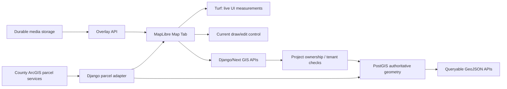

# GIS MVP Architecture Handoff

---

## BEFORE YOU START

Read this entire prompt before writing code.

Do **not** introduce new GIS infrastructure unless the existing code path cannot satisfy the MVP requirement. The current stack is mostly sound; the risk is authority, permissions, and route drift, not the choice of map library.

Do **not** import or mutate production GIS/source data during verification unless the task explicitly calls for it. Use read-only inspection first.

If anything is unclear about whether a geometry is:

- static published source data
- dynamic rendered data
- queryable but not editable feature data
- editable authoritative project data
- temporary user-drawn graphics
- raster imagery or plan overlay

ask before implementing. Do not blur these categories.

---

## OBJECTIVE

Apply the open-source GIS architecture review to the actual `landscape` codebase.

The recommended MVP architecture is:

```text
MapLibre GL JS
+ current draw tooling
+ Turf.js for lightweight client feedback
+ Django GIS APIs
+ PostGIS authoritative spatial tables/functions
+ durable overlay storage for plan/image drapes
+ county parcel adapters for external assessor feeds
```

The immediate goal is **not** to replace the GIS stack. The immediate goal is to make the existing stack production-safe and easier to evolve:

1. Keep MapLibre as the web renderer.
2. Keep the current drawing workflow for MVP.
3. Keep Turf limited to lightweight browser-side measurements and UI feedback.
4. Use PostGIS as the source of truth for authoritative geometry.
5. Consolidate around Django/PostGIS GIS endpoints for authoritative reads/writes.
6. Add missing project/tenant authorization to GIS endpoints before expanding editing.
7. Defer Martin, PMTiles, GeoServer, deck.gl, and Terra Draw until specific scale/workflow triggers appear.

---

## CURRENT CODEBASE CONTEXT

The repo already has a MapLibre-first GIS surface.

Key frontend files:

- `src/components/map-tab/MapTab.tsx` — full Map tab orchestrator: MapLibre canvas, Google basemaps, tax parcels, project boundaries, plan overlays, draw tools, market layers, demographics.
- `src/components/map-tab/MapCanvas.tsx` — MapLibre GL JS map rendering and layer management.
- `src/components/map-tab/hooks/useMapDraw.ts` — current draw/edit integration using `@mapbox/mapbox-gl-draw` plus Turf measurements.
- `src/components/map-tab/hooks/useMapFeatures.ts` — CRUD client for persisted drawn features.
- `src/components/map-tab/types.ts` — map feature/layer/view-state types.
- `src/components/map-tab/constants.ts` — layer groups and layer color definitions.
- `src/lib/gis/*` — GIS helpers for county parcel clients, overlays, snap index, plan extraction bridge, and georeferencing.

Key backend files:

- `backend/apps/gis/views.py` — parcel query, parcel ingest, and boundary set endpoints.
- `backend/apps/gis/parcel_services.py` — Maricopa/Pinal ArcGIS parcel adapter configuration.
- `backend/apps/gis/views_overlay.py` — saved site-plan/image overlay CRUD and upload endpoints.
- `backend/apps/gis/serializers.py` — GIS/overlay serializer validation.
- `backend/apps/location_intelligence/views.py` — demographics, POI, user points, and persisted map feature endpoints.

Known spatial tables/functions from schema/docs:

- `landscape.gis_project_boundary` — authoritative project boundary.
- `landscape.gis_tax_parcel_ref` — cached/reference tax parcel geometry.
- `landscape.gis_plan_parcel` — plan parcel geometry linked to project/parcel records.
- `landscape.tbl_project_overlay` — georeferenced site-plan/image overlays.
- `location_intelligence.project_map_features` — user-created drawn map features.
- `landscape.ingest_tax_parcel_selection(...)` — PostGIS parcel ingest / boundary union function.

Current package signals:

- `maplibre-gl` is installed and actively used.
- `@turf/turf` is installed and actively used.
- `@mapbox/mapbox-gl-draw` is installed and actively used.
- `react-map-gl` is installed, but the Map tab currently uses direct MapLibre.
- deck.gl, Terra Draw, PMTiles, Martin, and GeoServer are not part of the active app stack.

---

## ARCHITECTURE RECOMMENDATION

### MVP Architecture

Use the existing MapLibre/PostGIS architecture with targeted cleanup.



MVP component decisions:

- **MapLibre GL JS:** keep as the renderer.
- **Direct MapLibre integration:** keep for now; do not rewrite to React MapLibre unless component lifecycle/state complexity becomes a real problem.
- **Current draw tooling:** keep `@mapbox/mapbox-gl-draw` for MVP because it already works. Evaluate Terra Draw later, not now.
- **Turf.js:** keep for browser-side area/length/bbox/preview calculations only.
- **PostGIS:** use for authoritative geometry, spatial joins, unions, intersections, buffers, containment, proximity, and persisted analysis outputs.
- **Django GIS APIs:** use as the authoritative backend surface because the repo already has Django GIS endpoints and auth patterns.
- **County parcel adapters:** keep Maricopa/Pinal ArcGIS adapters for MVP. They are practical source connectors, not authoritative internal data until ingested.
- **Plan overlays:** keep current durable image overlay workflow. It already handles saved drapes, source-document provenance, and control-point georeferencing.

### Long-Term Production Architecture

The likely long-term architecture is a hybrid:

```text
React / Next UI
└── MapLibre GL JS
    ├── GeoJSON APIs for small project-scoped data
    ├── Martin + PostGIS for dynamic vector tiles when data volume grows
    ├── PMTiles for static published layers
    ├── PostGIS for authoritative geometry and server-side analysis
    ├── Raster tile/COG/WMS service for imagery/elevation/suitability layers
    └── Optional deck.gl for high-density analytical visualization
```

Future additions should be trigger-based:

- Add **Martin** when GeoJSON endpoints become too large or viewport rendering needs dynamic vector tiles from PostGIS.
- Add **PMTiles** for stable read-only layers: soils, land cover, FEMA/flood, census, jurisdiction boundaries, static parcel snapshots, conservation layers, published suitability outputs.
- Add **GeoServer** only if OGC services, WMS/WFS/WMTS, desktop GIS interoperability, complex raster publication, or enterprise GIS integration becomes a hard requirement.
- Add **deck.gl** only for large analytical visualization: dense points, heatmaps, temporal change, GPU aggregation, 3D terrain/building scenarios, flows, grids.
- Evaluate **Terra Draw** if current draw tooling fails on mobile/tablet, touch interactions, polygon editing UX, or MapLibre compatibility.
- Evaluate **Maputnik** only when custom style JSON becomes a design/product workflow, not for current Google/Esri basemap toggles.
- Use **GDAL/Tippecanoe** in offline ingestion pipelines for data prep and tile generation; do not put them in the request path.

---

## DATA-AUTHORITY MODEL

Keep these categories separate in code, database, API names, and UI labels.

### Static Published Layers

Examples:

- soils
- land cover
- FEMA/flood
- jurisdiction boundaries
- census geography
- hydrology reference layers
- public conservation/open-space layers

Recommended serving:

- MVP: external services or small GeoJSON where acceptable.
- Later: PMTiles for static vector/raster tiles.
- Backend: metadata table for layer catalog, attribution, source date, license, refresh cadence.

Do not treat these as editable project records.

### Dynamic Vector Tiles

Examples:

- many project features across a region
- many parcels
- scenario geometries at high volume
- viewport-filtered project/asset layers

Recommended serving:

- MVP: GeoJSON APIs by project/bbox.
- Later: Martin over PostGIS.

Trigger for Martin: API payloads, render time, or memory usage become problematic with normal user projects.

### Queryable Features

Examples:

- parcel details
- assessor attributes
- sales/rent comps
- competitor projects
- POIs
- demographic geography

Recommended serving:

- JSON/GeoJSON API endpoints with filters and project/tenant enforcement.
- Use PostGIS for spatial filters.
- Keep source attribution and freshness metadata.

Queryable does not imply editable.

### Editable Authoritative Data

Examples:

- project boundary
- management unit/site polygon
- plan parcel geometry
- saved project features
- observation points/lines/polygons
- asset inventory locations
- scenario alternative geometry

Recommended serving:

- PostGIS tables with `project_id`, owner/tenant fields, edit metadata, and audit history.
- Django APIs with project-level permission checks.
- Geometry validation server-side.
- Client can preview with Turf, but server computes authoritative metrics.

### Client-Side Analysis

Appropriate for Turf:

- live area/length/perimeter preview while drawing
- bbox calculation for viewport queries
- simple visual buffers for immediate UI feedback
- point-in-polygon UI hints
- snapping candidate filtering at small scale
- measuring temporary graphics

Do not rely on Turf for authoritative persisted calculations.

### Server-Side Analysis

Use PostGIS/backend for:

- parcel union/dissolve
- intersections
- setbacks and buffers that affect project data
- suitability/prioritization calculations
- acreage used in financial assumptions
- hydrology/soil/land-cover overlays
- scenario comparison outputs
- multi-layer spatial joins
- permission-sensitive queries
- repeatable exports/reports

### Raster Services

Examples:

- imagery
- elevation
- slope
- hydrology rasters
- suitability surfaces
- scanned/georeferenced plans

MVP:

- Continue current basemaps and saved image overlays.
- Keep `tbl_project_overlay` for georeferenced site-plan drapes.

Future:

- Cloud Optimized GeoTIFFs plus tile service for raster analytics.
- GeoServer if WMS/WMTS or complex raster styling/publication is needed.
- Pre-rendered XYZ tiles for static suitability outputs.

### Temporary User-Drawn Graphics

Examples:

- measuring a line
- sketching an AOI before save
- draft polygon before confirmation
- unsaved markup

Recommended behavior:

- Keep in client state.
- Do not persist until user explicitly saves or confirms.
- Clearly label when a temporary graphic becomes authoritative project data.

---

## IMMEDIATE IMPLEMENTATION PRIORITIES

### 1. Fix GIS Authorization Before More Editing

Several GIS endpoints currently require authentication but do not appear to enforce project ownership/tenant access.

Inspect and patch:

- `backend/apps/gis/views.py`
  - `parcel_ingest`
  - `boundary_set`
  - `GISViewSet.get_boundaries`
  - `GISViewSet.update_boundaries`
- `backend/apps/gis/views_overlay.py`
  - `ProjectOverlayViewSet.list`
  - `ProjectOverlayViewSet.create`
  - `ProjectOverlayViewSet.retrieve`
  - `ProjectOverlayViewSet.partial_update`
  - `ProjectOverlayViewSet.destroy`
  - `overlay_image_upload`
- `backend/apps/location_intelligence/views.py`
  - `map_features_list`
  - `map_features_create`
  - `map_feature_detail`

Expected pattern:

- Verify request user is authenticated.
- Verify user has access to the target `project_id`.
- Return 404 for inaccessible project-scoped resources where appropriate.
- Ensure feature/overlay detail routes validate access through the feature/overlay's `project_id`, not only the object id.
- Keep admin/superuser behavior consistent with existing project access rules.

Do not rely on frontend route guards for GIS security.

### 2. Consolidate Authoritative GIS APIs

There are older Next API routes and newer Django/PostGIS endpoints that overlap.

Review:

- `src/app/api/gis/project-boundary/route.ts`
- `src/app/api/gis/ingest-parcels/route.ts`
- `src/app/api/projects/[projectId]/map/route.ts`
- `backend/apps/gis/views.py`

Recommendation:

- Prefer Django/PostGIS endpoints for authoritative boundary/parcel ingest.
- Treat Next routes as proxies or deprecate them if they duplicate/placeholder behavior.
- Replace approximate footprint logic with `gis_project_boundary` / `gis_plan_parcel` when available.

Important example:

- `src/app/api/projects/[projectId]/map/route.ts` currently generates an approximate rectangle around a project coordinate. That is acceptable as fallback only. It should not be presented as authoritative footprint geometry.

### 3. Normalize GIS Domain Model

Clarify which current storage locations own which type of geometry:

- `gis_project_boundary` — one authoritative active project boundary.
- `gis_plan_parcel` — plan/design parcel geometries tied to `tbl_parcel`.
- `location_intelligence.project_map_features` — user-created annotations/features, not necessarily authoritative project boundary.
- `tbl_project_overlay` — georeferenced raster/image overlays, not vector geometry.
- `gis_tax_parcel_ref` — external parcel reference/cache.

If adding new tables, prefer explicit names over generic JSON blobs:

- `gis_site`
- `gis_management_unit`
- `gis_observation`
- `gis_asset`
- `gis_scenario`
- `gis_scenario_feature`
- `gis_attachment_link`
- `gis_edit_history`

Each authoritative table should include:

- `project_id`
- `created_by`
- `updated_by`
- `created_at`
- `updated_at`
- `deleted_at` or `is_active`
- source/provenance fields
- geometry SRID convention
- GIST index on geometry
- tenant/ownership enforcement path

### 4. Keep Turf In Its Lane

Current Turf use for live measurements is fine.

Do not expand Turf into authoritative analytics. If a result affects project economics, persisted acreage, scenario scores, regulatory setbacks, or exported reports, compute it server-side in PostGIS and store provenance.

### 5. Keep Current Drawing Tool For MVP

Do not replace `@mapbox/mapbox-gl-draw` solely because Terra Draw exists.

Evaluate Terra Draw only if there are concrete issues:

- touch/tablet editing is poor
- MapLibre compatibility issues become costly
- polygon vertex editing is unreliable
- snapping/selection UX becomes central
- package maintenance risk becomes material

If evaluating Terra Draw, build a small spike behind a feature flag instead of rewriting the Map tab.

---

## FUTURE FUNCTIONALITY REFERENCE

### Scenario Comparison

Expected need:

- before/after plans
- design alternatives
- suitability alternatives
- phasing alternatives

Recommended model:

- `gis_scenario`
- `gis_scenario_feature`
- link scenario geometry to project parcels, overlays, assumptions, and reports

Rendering:

- MVP: GeoJSON per selected scenario.
- Later: Martin vector tiles for large scenarios.
- deck.gl only if GPU aggregation/temporal animation is needed.

### Suitability / Prioritization Analysis

Expected inputs:

- slope
- soils
- flood/hydrology
- habitat
- access/proximity
- constraints
- parcel attributes

Recommended approach:

- PostGIS for vector overlays.
- Raster processing pipeline for raster surfaces.
- Store output as vector polygons or raster tiles with metadata and scoring assumptions.
- PMTiles or raster tiles for static published outputs.

Do not run serious suitability scoring only in the browser.

### Field Observations / Inspections

Recommended model:

- `gis_observation`
- point/line/polygon geometry
- observed_at
- observer/user
- status/category
- notes
- attachment links
- offline sync metadata if field mode is added

MVP:

- simple online point/polygon capture using existing draw workflow.

Future:

- mobile-first capture UI
- offline queue
- photo upload with EXIF/GPS
- conflict resolution

### Asset Inventory

Recommended model:

- `gis_asset`
- asset type
- lifecycle/status
- geometry
- attributes JSONB for type-specific fields
- attachment links
- inspection/maintenance history

Rendering:

- GeoJSON for project-scale.
- Vector tiles when many assets are visible regionally.

### Exporting Maps / Selected Data

MVP:

- GeoJSON export for selected features.
- Server-generated CSV/GeoJSON for query results.

Future:

- PDF map exports.
- Shapefile/GeoPackage export via backend/GDAL.
- Styled map snapshot export.

### Raster / Imagery

MVP:

- Keep current basemaps.
- Keep saved georeferenced plan overlays.

Future:

- COG storage for elevation/slope/suitability.
- Tile service for map rendering.
- GeoServer only if WMS/WMTS/desktop GIS workflows are required.

---

## RISKS AND MITIGATIONS

### Risk: Multi-Tenant GIS Data Leak

GIS records are project-scoped and may include sensitive project boundaries, plans, observations, and attachments.

Mitigation:

- Add backend project access checks everywhere GIS records are read or mutated.
- Validate detail routes via the record's project id.
- Add tests for cross-project read/update/delete denial.

### Risk: Authority Drift

The app currently has temporary graphics, map features, project boundaries, tax parcel refs, overlays, and approximate footprints.

Mitigation:

- Name data categories clearly.
- Use PostGIS authoritative tables for persisted project geometry.
- Treat approximate coordinate footprints as fallback only.
- Avoid storing authoritative geometry only in `tbl_project.gis_metadata`.

### Risk: Duplicated API Paths

Next and Django GIS routes overlap.

Mitigation:

- Make Next routes thin proxies or deprecate them.
- Keep PostGIS mutation logic in one backend path.
- Document canonical endpoints.

### Risk: Premature Infrastructure

Martin, PMTiles, GeoServer, deck.gl, and Terra Draw all add maintenance cost.

Mitigation:

- Add each only after a measurable need.
- Prefer data-volume/workflow triggers over theoretical completeness.

### Risk: Browser-Side Analysis Becomes Authoritative

Turf is convenient but not the right authority for persisted regulatory or financial calculations.

Mitigation:

- Use Turf for preview.
- Recompute and persist authoritative metrics in PostGIS.
- Store source/provenance and calculation version.

### Risk: External County Services Are Slow or Unavailable

The app depends on county ArcGIS services for parcel query.

Mitigation:

- Keep fast timeouts.
- Cache selected/reference parcels in `gis_tax_parcel_ref`.
- Consider PMTiles/static snapshots for high-use counties later.
- Show graceful UI failures.

---

## PHASED PLAN

### Phase 0: Guardrails And Inventory

- Confirm canonical GIS endpoints.
- Inventory which endpoints mutate geometry.
- Add/verify project ownership checks.
- Document static/queryable/editable/temporary/raster categories.

### Phase 1: MVP Hardening

- Patch GIS auth/tenant checks.
- Route authoritative boundary writes through Django/PostGIS.
- Replace approximate map footprint with PostGIS boundary when available.
- Keep current MapLibre/draw/Turf UI.
- Add tests for cross-project access denial.

### Phase 2: Domain Model Cleanup

- Clarify `project_map_features` vs `gis_project_boundary` vs `gis_plan_parcel`.
- Add edit history/versioning for authoritative geometry.
- Add provenance fields for source-derived geometry.
- Add export endpoints for selected project geometry.

### Phase 3: Static Layer Catalog

- Add a layer catalog for soils, flood, land cover, hydrology, census, jurisdiction layers.
- Start with external URLs or small GeoJSON.
- Move high-value stable layers to PMTiles when usage justifies it.

### Phase 4: Dynamic Tiles And Advanced Analysis

- Add Martin for dynamic vector tiles from PostGIS if GeoJSON becomes too heavy.
- Add raster tile/COG service for suitability/elevation/slope.
- Add deck.gl only for visualization workloads MapLibre cannot handle efficiently.

### Phase 5: Field / Mobile Workflow

- Add field observations, asset inventory, attachments, and offline sync semantics.
- Re-evaluate draw library at this point; Terra Draw may become more attractive.

---

## SUCCESS CRITERIA

For MVP architecture work:

- [ ] No new GIS infrastructure added without a documented trigger.
- [ ] Project-scoped GIS endpoints enforce project/tenant access.
- [ ] Canonical authoritative geometry path is Django/PostGIS.
- [ ] Approximate coordinate rectangles are fallback only, not authoritative footprints.
- [ ] Turf remains preview/measurement-only.
- [ ] Static/queryable/editable/temporary/raster layer categories are documented.
- [ ] Existing Map tab behavior remains intact.
- [ ] Tests cover at least one cross-project denial case for GIS read/write.

Recommended verification:

```bash
npm run build
npx eslint src/components/map-tab src/lib/gis
python manage.py test apps.gis apps.location_intelligence
```

If local Playwright/browser dependencies are missing, note that explicitly rather than treating it as an app failure.

---

## FINAL RECOMMENDATION

The smallest sensible GIS stack for `landscape` is:

```text
MapLibre GL JS
+ existing draw control
+ Turf.js for lightweight client feedback
+ Django APIs
+ PostGIS authoritative spatial storage/analysis
+ durable overlay storage
+ county parcel adapters
```

Do not migrate to Martin, PMTiles, GeoServer, deck.gl, or Terra Draw as part of the MVP. Keep those as future options with clear triggers.

The highest-value work is security and authority cleanup, not a GIS tooling rewrite.
